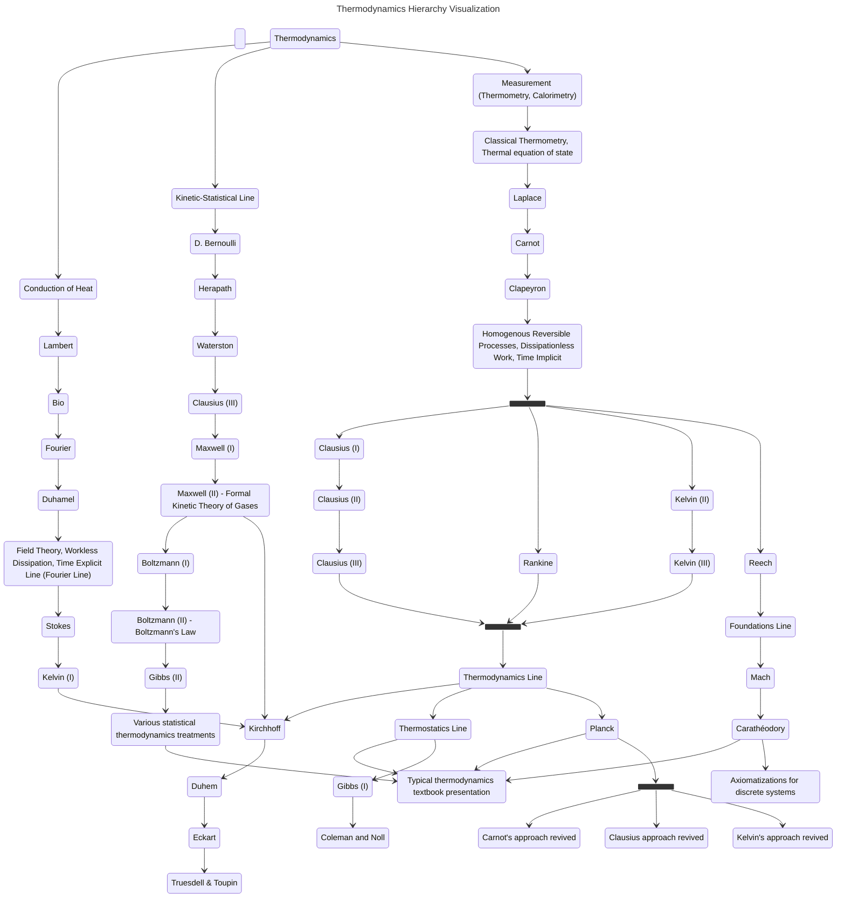

```mermaid

---

title: Thermodynamics Hierarchy Visualization

---


stateDiagram-v2

state fork\_state <<fork>>

state fork\_state1 <<fork>>

state join\_state <<join>>

&nbsp;	thermo1: Thermodynamics

&nbsp;	cof1: Conduction of Heat

&nbsp;	kinstat1: Kinetic-Statistical Line

&nbsp;	meas1: Measurement (Thermometry, Calorimetry)

&nbsp;	cof2: Lambert

&nbsp;	cof3: Bio

&nbsp;	cof4: Fourier

&nbsp;	cof5: Duhamel

&nbsp;	cof6: Field Theory, Workless Dissipation, Time Explicit Line (Fourier Line)

&nbsp;	cof7: Stokes

&nbsp;	cof8: Kelvin (I)

&nbsp;	cof9: Kirchhoff

&nbsp;	cof10: Duhem

&nbsp;	cof11: Eckart

&nbsp;	cof12: Truesdell \& Toupin

&nbsp;	meas2: Classical Thermometry, Thermal equation of state

&nbsp;	meas3: Laplace

&nbsp;	meas4: Carnot

&nbsp;	meas5: Clapeyron

&nbsp;	meas6: Homogenous Reversible Processes, Dissipationless Work, Time Implicit

&nbsp;	meas7a: Clausius (I)

&nbsp;	meas7b: Rankine

&nbsp;	meas7c: Kelvin (II)

&nbsp;	meas7d: Reech

&nbsp;	meas7a1: Clausius (II)

&nbsp;	meas7a2: Clausius (III)

&nbsp;	meas7c1: Kelvin (III)

&nbsp;	meas7d1: Foundations Line

&nbsp;	meas8: Thermodynamics Line

&nbsp;	meas9: Thermostatics Line

&nbsp;	meas9a: Gibbs (I)

&nbsp;	meas9b: Coleman and Noll

&nbsp;	meas10: Planck

&nbsp;	meas10a: Carnot's approach revived

&nbsp;	meas10b: Clausius approach revived

&nbsp;	meas10c: Kelvin's approach revived

&nbsp;	kinstat2: D. Bernoulli

&nbsp;	kinstat3: Herapath

&nbsp;	kinstat4: Waterston

&nbsp;	kinstat5: Clausius (III)

&nbsp;	kinstat6: Maxwell (I)

&nbsp;	kinstat7: Maxwell (II) - Formal Kinetic Theory of Gases

&nbsp;	kinstat8: Boltzmann (I)

&nbsp;	kinstat9: Boltzmann (II) - Boltzmann's Law

&nbsp;	kinstat10: Gibbs (II)

&nbsp;	kinstat11: Various statistical thermodynamics treatments

&nbsp;	found1: Mach

&nbsp;	found2: Carathéodory

&nbsp;	found3: Axiomatizations for discrete systems

&nbsp;	textbook1: Typical thermodynamics textbook presentation

&nbsp;		thermo1 --> cof1 

&nbsp;			cof1 --> cof2

&nbsp;			cof2 --> cof3

&nbsp;			cof3 --> cof4

&nbsp;			cof4 --> cof5

&nbsp;			cof5 --> cof6

&nbsp;			cof6 --> cof7

&nbsp;			cof7 --> cof8

&nbsp;			cof8 --> cof9

&nbsp;			cof9 --> cof10

&nbsp;			cof10 --> cof11

&nbsp;			cof11 --> cof12

&nbsp;		thermo1 --> kinstat1

&nbsp;			kinstat1 --> kinstat2

&nbsp;			kinstat2 --> kinstat3

&nbsp;			kinstat3 --> kinstat4

&nbsp;			kinstat4 --> kinstat5

&nbsp;			kinstat5 --> kinstat6

&nbsp;			kinstat6 --> kinstat7

&nbsp;			kinstat7 --> kinstat8

&nbsp;			kinstat7 --> cof9

&nbsp;			kinstat8 --> kinstat9

&nbsp;			kinstat9 --> kinstat10

&nbsp;			kinstat10 --> kinstat11

&nbsp;			kinstat11 --> textbook1

&nbsp;		thermo1 --> meas1

&nbsp;			meas1 --> meas2

&nbsp;			meas2 --> meas3

&nbsp;			meas3 --> meas4

&nbsp;			meas4 --> meas5

&nbsp;			meas5 --> meas6

&nbsp;			meas6 --> fork\_state

&nbsp;			fork\_state --> meas7a

&nbsp;			fork\_state --> meas7b

&nbsp;			fork\_state --> meas7c

&nbsp;			fork\_state --> meas7d

&nbsp;			meas7a --> meas7a1

&nbsp;			meas7a1 --> meas7a2

&nbsp;			meas7c --> meas7c1

&nbsp;			meas7d --> meas7d1

&nbsp;			meas7d1 --> found1

&nbsp;			found1 --> found2

&nbsp;			found2 --> textbook1

&nbsp;			found2 --> found3

&nbsp;			meas7a2 --> join\_state

&nbsp;			meas7b --> join\_state

&nbsp;			meas7c1 --> join\_state

&nbsp;			join\_state --> meas8

&nbsp;			meas8 --> cof9

&nbsp;			meas8 --> meas9

&nbsp;			meas9 --> textbook1

&nbsp;			meas9 --> meas9a

&nbsp;			meas9a --> meas9b

&nbsp;			meas8 --> meas10

&nbsp;			meas10 --> textbook1

&nbsp;			meas10 --> fork\_state1

&nbsp;			fork\_state1 --> meas10a

&nbsp;			fork\_state1 --> meas10b

&nbsp;			fork\_state1 --> meas10c


&nbsp;	

```

#thermodynamics

