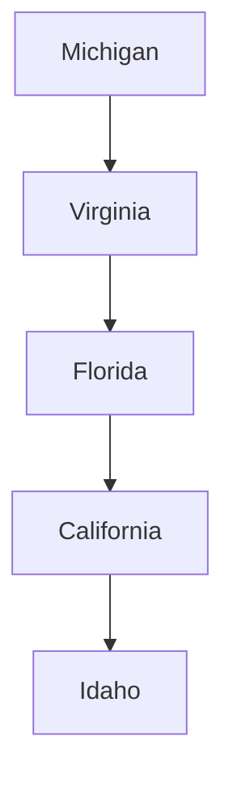

---

layout: ../layouts/BaseLayout.astro

---

## Personal:
*From Michigan to Virginia to Florida to California to Idaho.* I grew up in Michigan and Virginia. I received my PhD from the University of Virginia in Engineering Physics and my research was in the field of chaos theory. Joining a medical device startup allowed me to go to Florida, then California. After living in California from 1997 to 2020, I now reside with my wife in Idaho on the Western Slopes of the Grand Tetons, on the other side of the range from Jackson, Wyoming.

## Professional: 
During my career I've spent time performing six main functions  
1) Strategic Planning  
2) Negotiating agreements  
3) Managing technical professionals  
4) Writing for publication  
5) Inventing for business  
6) Promoting innovation  
  
While at UC San Diego I helped with the formation of over 20 startups, and negotiated over 200 high risk/high reward commercialization agreements. 
I helped lead an office that brought in over \$20M in revenue to the university, with operations costs of around \$5M.  Since my retirement in 2020, I've served as a Rehired Retiree at UC San Diego, UCLA, 
UC Santa Barbara, and UC's Division of Agriculture and Natural Resources.
  
Specialties: Commercialization and entrepreneurship, Intellectual property management, university technology transfer, negotiation

## Talks on Youtube:

  <iframe src="https://www.youtube-nocookie.com/embed/AR1pW4VfQyc" title="YouTube video player" frameborder="0" allow="accelerometer; autoplay; clipboard-write; encrypted-media; gyroscope; picture-in-picture" allowfullscreen></iframe>

 

I start moderating the discussion at 41 minutes into this talk by Todd Coleman.

  <iframe src="https://www.youtube-nocookie.com/embed/KCCcGh3L9Dk?si=EHNfggQKqAyexArc&t=2414" title="YouTube video player" frameborder="0" allow="accelerometer; autoplay; clipboard-write; encrypted-media; gyroscope; picture-in-picture" allowfullscreen></iframe>

$$
\nabla^2 \vec{u}+ \vec{u}\cdot\nabla \vec{u} = \vec{f}(\vec{x})
$$

