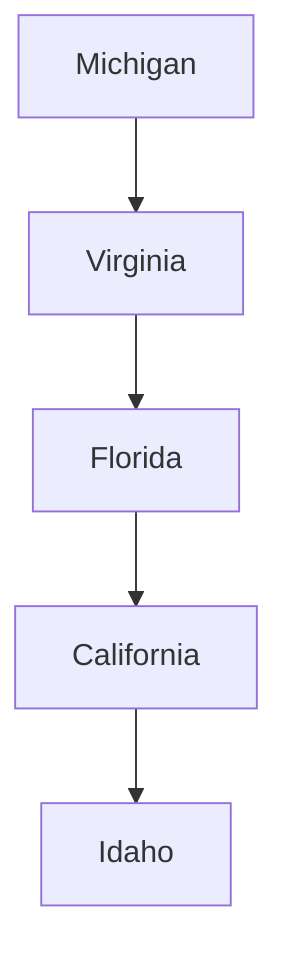

---

layout: ../layouts/BaseLayout.astro

---

E-mail: wjdecker "at" pobox.com or wjd4x "at" live.com or decker "at" virginia.edu or wdecker "at" ucsd.edu

Other social media (where I am slower to respond):
[LinkedIn](https://www.linkedin.com/in/wjdecker/)
[Instagram](https://www.instagram.com/wjdecker68/)
[Threads](https://www.threads.com/@wjdecker68)
[Mastadon](https://mastodon.online/@wjdecker)
[GitHub](https://github.com/wjdecker)
[Twitter/X](https://x.com/wjdecker)
[Bluesky](https://bsky.app/profile/wjdecker.bsky.social)

Other websites where I am listed:
[Board Game Geek](https://boardgamegeek.com/profile/wjdecker)
[LibraryThing](https://www.librarything.com/catalog/wjdecker/yourlibrary)

$$
\nabla^2 \vec{u}+ \vec{u}\cdot\nabla \vec{u} = \vec{f}(\vec{x})
$$

