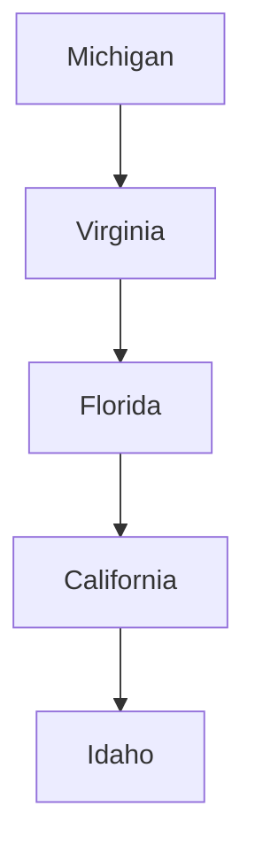

---

layout: ../layouts/BaseLayout.astro

---

```mermaid
graph TB
A[Michigan] --> B[Virginia]
B --> C[Florida]
C --> D[California]
D --> E[Idaho]
```

$$
\nabla^2 \vec{u}+ \vec{u}\cdot\nabla \vec{u} = \vec{f}(\vec{x})
$$

